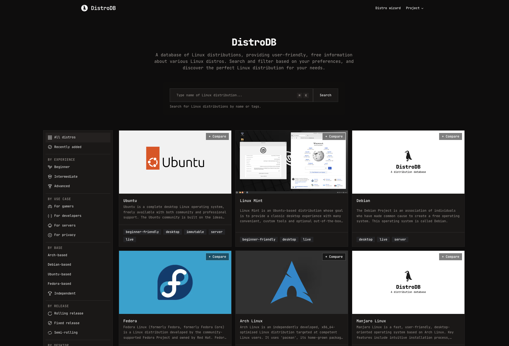

# DistroDB 🐧

A modern, aesthetically pleasing alternative to Distrowatch. DistroDB aims to provide comprehensive information about Linux distributions with a focus on UI/UX, powerful search/filtering, and a personalized recommendation engine.



## ✨ Main Features

- **Visual Discovery**: Clean, card-based design with high-quality screenshots and native dark mode.
- **Distro Wizard**: An interactive quiz to find your ideal distribution based on your use case and experience level.
- **Side-by-Side Comparison**: Compare technical specifications between distributions at a glance.
- **Advanced Filtering**: Search by package managers, init systems, architectures, and origin.
- **Lightning Fast**: Built with Next.js App Router for optimal performance.

## 🚀 Getting Started

This is a pnpm monorepo: `apps/web` (the Next.js site) and `apps/cms` (Payload CMS, Postgres-backed).

### Prerequisites

- Node.js 20+
- pnpm (recommended) or npm
- PostgreSQL (for `apps/cms`) - `docker compose up -d` from `apps/cms` starts one locally

### Installation

1. Clone the repository:

   ```bash
   git clone git@github.com:NSWEB-OU/distrodb.git
   cd distrodb
   ```

2. Install dependencies:

   ```bash
   pnpm install
   ```

3. Start Postgres and the CMS, then seed it once:

   ```bash
   cd apps/cms && docker compose up -d && cd ../..
   pnpm dev:cms      # in one terminal, leave running
   pnpm --filter @distrodb/cms seed   # one-off, populates distros from the legacy JSON
   ```

4. Start both apps (or just `pnpm dev:web` if the CMS is already running):

   ```bash
   pnpm dev
   ```

5. Open [http://localhost:3000](http://localhost:3000) for the site and [http://localhost:3001/admin](http://localhost:3001/admin) for the CMS.

## 🤝 Contributing

We love contributions! Whether you're fixing a bug, adding a new feature, or simply adding a Linux distribution that we missed.

### Adding a Distribution

To add a new distro (data + images), please follow our **[Asset & Data Contribution Guide](CONTRIBUTING.md)**.

### Code Contributions

1. Fork the Project
2. Create your Feature Branch (`git checkout -b feature/AmazingFeature`)
3. Commit your Changes (`git commit -m 'Add some AmazingFeature'`)
4. Push to the Branch (`git push origin feature/AmazingFeature`)
5. Open a Pull Request

## 💖 Support

If you find DistroDB helpful, please consider supporting the project:

- **Star the Repo**: It helps more people discover the project.
- **Report Bugs**: Open an issue if something isn't working.
- **Suggest Features**: We're always looking to improve!
- **Spread the Word**: Share DistroDB with your fellow Linux enthusiasts.

## 📜 License

Distributed under the MIT License. See `LICENSE` for more information.

---

Built with ❤️ for the Linux Community.
